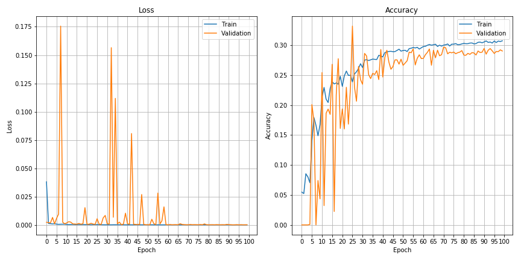
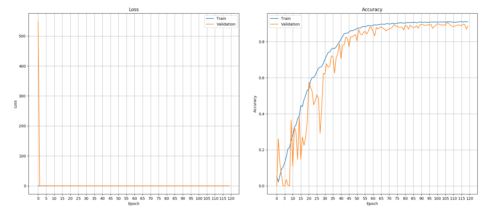

# Pointnet2_Semantic_Segmentation

This repository implements a pointnet++ based sementic segmentation task of a table top scene containing objects to be assembled by a cobot manipulator. A Semantic segmentation network trained with a pointnet++ backbone with different types of input features is evaluated for its performance accuracy. The dataset used in the implementation is a simulation based dataset of an assembly with corresponding assembly steps. For clarity, this implementation prioritizes the focus on the class imbalance problem over other important components in the sim2real gap domain such as noise, occlusions, non dataset objects and high level appearnce information such as surface textures. 


<figure align="center" style="padding-top: 20px; padding-bottom: 20px;">
  
  <figcaption>  <p style="text-align: center; font-size: 9px"> <a> Semantic Segmentation of Multi-step Assembling Scene from Nema17_Gear_Reducer dataset </a></p> </figcaption>
</figure>


## Setp 1: Installation

1.1 Install requirements.txt to a virtual environment

```
$ pip install -re requirements-txt
```
1.2 Install [python-pcl](https://github.com/strawlab/python-pcl)

1.3 Build [Pointnet++](https://github.com/erikwijmans/Pointnet2_PyTorch)

```
$ python3 setup.py build_ext
```
## Step 2: Download/Generate dataset and preprocess for sampling

2.1 Download dataset the dataset from [here]() or generate your own dataset following instructions [here](https://github.com/KulunuOS/6DAPose?tab=readme-ov-file#generate-the-dataset-locally) and copy them inside /datasets folder in root directory

2.2 Remember to change the path names in the [dataloader](https://github.com/KulunuOS/Pointnet2_SemSeg/blob/main/lib/custom_dataloader.py) correctly according to you installaion

2.3 Preprocess sampled data by following the Jupyter notebook [here](https://github.com/KulunuOS/Pointnet2_SemSeg/blob/main/Jupyter_notebooks/Dataset_Preprocessing.ipynb)

2.4 Remember to confirm that you sampled data correctly by vizualizing the sampled data.


## Step 3: Train

### 3.1 To train the network with only geometric features

```
$ python3 -m tarin.train_Seg.py
```
- Training above for proved that learning alone on geometric information is challenging for a dataset with higher class imbalance even without factors such as noise, occlusions, non dataset objects etc.
The validation accuracy did not exceed 30%




### 3.2 To train the network with fused geometric and appearance (Depth + RGB) features

```
$ python3 -m tarin.train_DenseSeg.py
```

- Training on DenseFused RGB features and Geometric features proved effective with validation accuracy above 90%




## Step 4: Test

The last section of this [notebook](https://github.com/KulunuOS/Pointnet2_SemSeg/blob/main/Jupyter_notebooks/Pointnet2_Segmentation.ipynb) provides with a script to test the trained model on unseen sålits of data

## References

1. PVN3D : https://github.com/ethnhe/PVN3D
2. Pointnet++ Pytorch : https://github.com/erikwijmans/Pointnet2_PyTorch
3. 6DAPose : https://github.com/KulunuOS/6DAPose?tab=readme-ov-file


